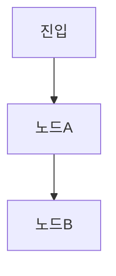

# <FE_NAME> 플로우

```mermaid
flowchart TD
  %% 노드 = 요소/<노드>.md 1개. 분기·루프·점선 전이 포함.
  진입 --> 노드A --> 노드B
```

## FE 전체 값
- **입력 계약** *(진입 시 받는 값 — 목록만, 수치는 [입력 필요])*
- **노드 간 전이값** *(노드→노드로 넘기는 값)*
- **출력** *(나갈 때 넘기는 값)*

## 전역 연출 (V)
*상시 HUD·공통 표현 등. 없으면 (없음).*
