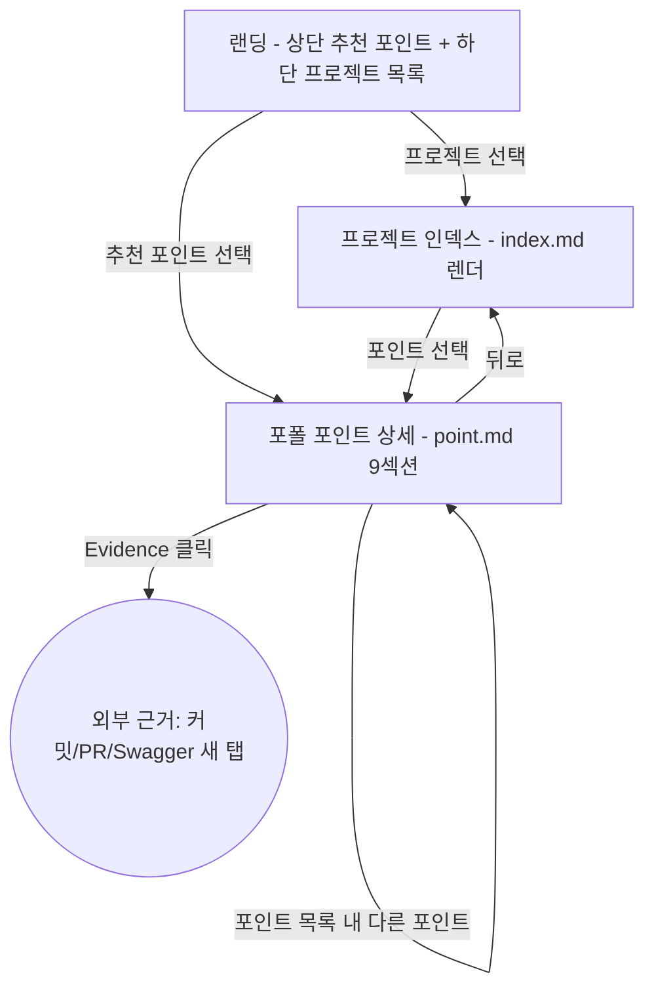

# fe/browse 플로우

## FE 전체 값
- **입력 계약** *(진입 시 받는 값)*
  - 진입 = 랜딩(루트 URL). 받는 값 없음(공개 페이지).
  - 노출 대상은 `status: published` 포인트만. published 0개면 랜딩에 빈 상태 안내 표시(카피는 구현).
- **노드 간 전이값** *(노드→노드로 넘기는 값)*
  - 랜딩 → 프로젝트인덱스: `project` 식별자(slug)
  - 랜딩/프로젝트인덱스 → 포인트상세: 포폴 포인트 `id`(+ 소속 `project`)
  - 포인트상세 → 외부근거: Evidence 항목의 외부 URL(커밋/PR/Swagger)
- **출력** *(나갈 때 넘기는 값)*
  - 외부근거: 외부 URL 새 탭 이탈(앱 밖).
  - 챗봇 진입(전역 FAB): [fe/chat](../chat/)에 **현재 보던 포인트 `id`를 맥락으로 전달**(포인트 상세에서 열면). 랜딩·인덱스에서 열면 무맥락 전역.

## 전역 연출 (V)
- **전역 우하단 FAB (챗봇 진입 · 상시)** — 랜딩·프로젝트인덱스·포인트상세 모든 화면에 우하단 고정으로 떠 있는 챗봇 열기 버튼. 누르면 [fe/chat](../chat/) 진입. 본 도메인은 *진입구*만 소유하고 대화는 fe/chat이 맡는다.
  - 접근성(리서치 근거): 키보드 조작 가능 + Esc로 닫고 포커스 복귀, 터치 타겟 ≥44px, 모바일 safe-area offset. 미세 수치(px·위치)는 구현.
  - 인라인 텍스트 선택-질문은 **v3로 연기** — v1은 전역 FAB 단독.
