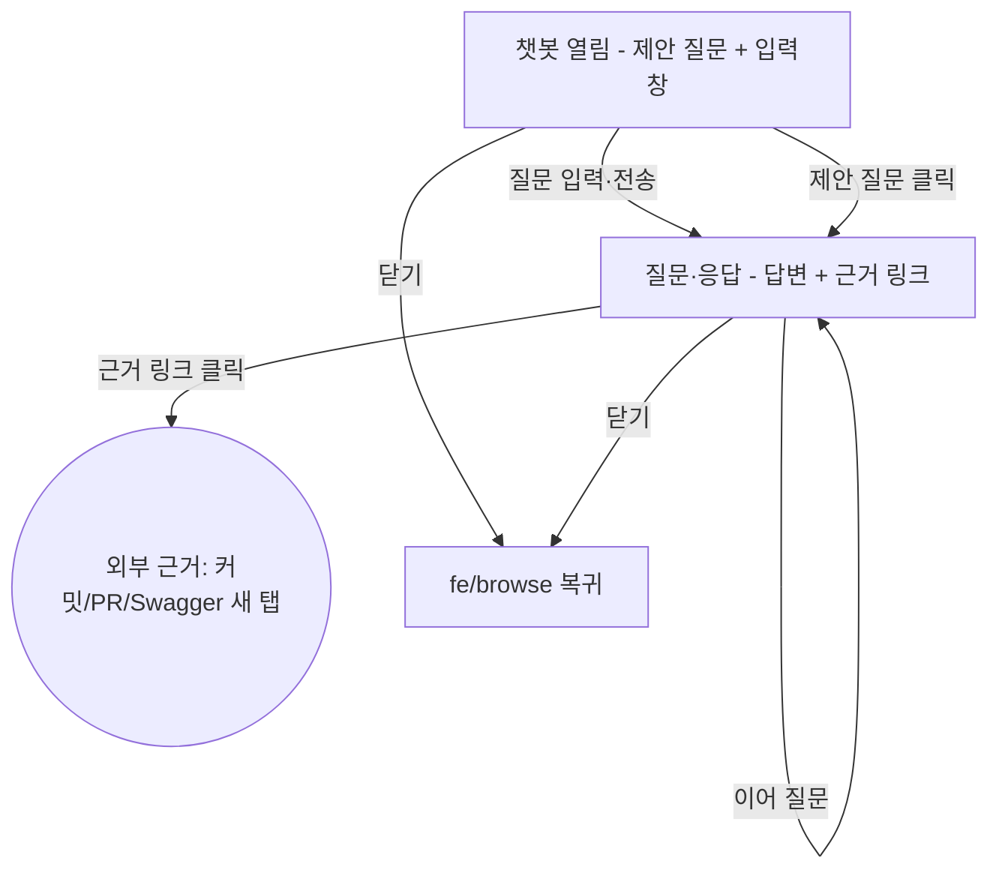

# fe/chat 플로우

## FE 전체 값
- **입력 계약** *(진입 시 받는 값)*
  - fe/browse 전역 FAB에서 진입. 받는 값: **진입 맥락** = 현재 보던 포폴 포인트 `id`(포인트 상세에서 열면) 또는 무맥락(랜딩·인덱스에서 열면 전역).
  - 재방문 시: 기존 **대화 이력**을 로드. 인증 없는 공개 페이지라 식별 수단 미정 — *[입력 필요: 이력 영속 키(브라우저 localStorage / 익명 세션 id 등)]*
  - (v3) 인라인 선택-질문 진입 시 선택 텍스트 — v1 미포함.
- **노드 간 전이값** *(노드→노드로 넘기는 값)*
  - 챗봇열림 → 질문응답: 질문 텍스트(입력 또는 클릭한 제안 질문) + 진입 맥락
  - 질문응답 → 질문응답(멀티턴): 누적 대화 이력
- **출력** *(나갈 때 넘기는 값)*
  - 외부근거: Evidence 외부 URL(새 탭 이탈)
  - 복귀: fe/browse로 돌아감(이력은 영속되어 다음에 이어짐)

## 전역 연출 (V)
- 패널형 챗 UI(우하단 FAB로 열린 오버레이/패널 — 진입 버튼은 fe/browse 소유).
- 접근성(리서치 근거): 열릴 때 입력 필드로 포커스 이동, Esc로 닫고 FAB로 포커스 복귀, 메시지 영역 `role="log"`+`aria-live`. 미세값 *[입력 필요]*.
